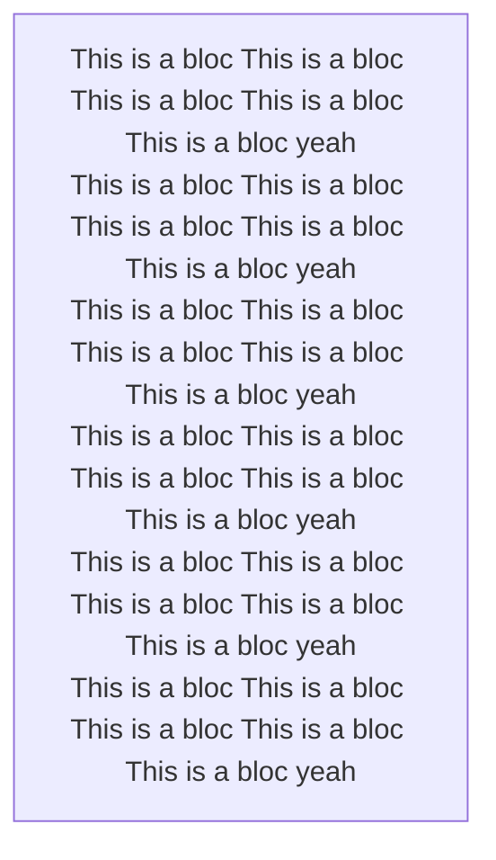

# otodok
Write your functional specs into your code and generate a visual documentation from it!

```mermaid
flowchart TD
    id01[This is a bloc This is a bloc This is a bloc This is a bloc This is a bloc yeah\nThis is a bloc This is a bloc This is a bloc This is a bloc This is a bloc yeah\nThis is a bloc This is a bloc This is a bloc This is a bloc This is a bloc yeah\nThis is a bloc This is a bloc This is a bloc This is a bloc This is a bloc yeah\nThis is a bloc This is a bloc This is a bloc This is a bloc This is a bloc yeah\nThis is a bloc This is a bloc This is a bloc This is a bloc This is a bloc yeah]
```